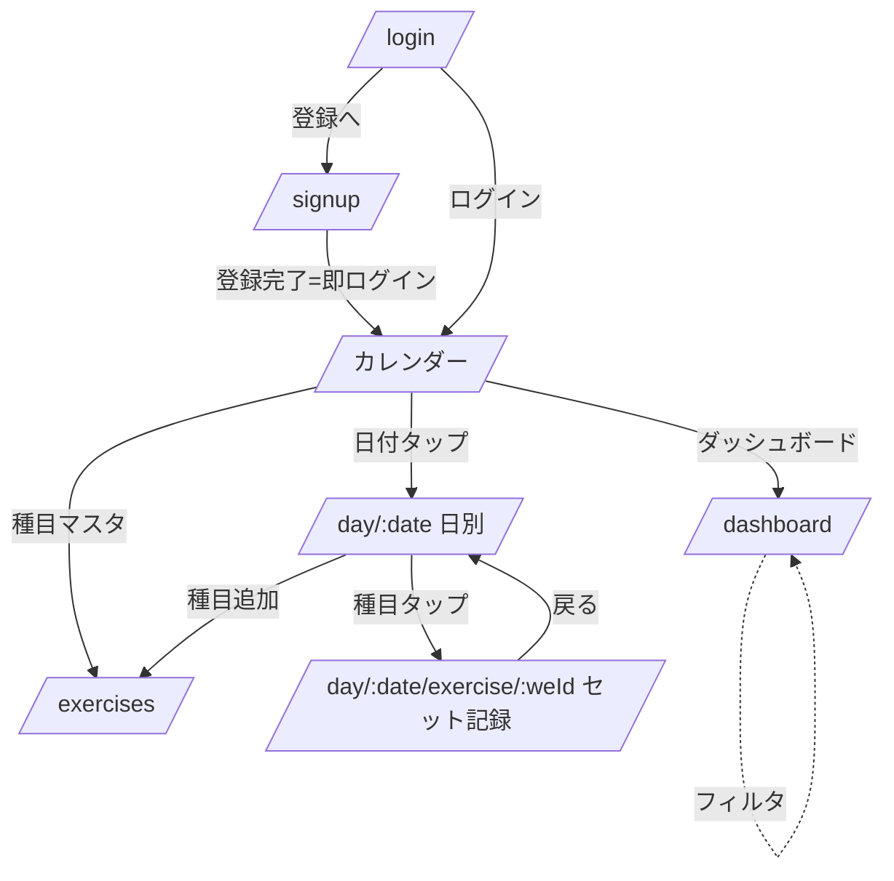

# 画面遷移・画面仕様（§6-6）

要件 F-01〜F-05 と §9 の決定事項を画面に落とす。OVLD スクショ（SS1/2/3/4/5/6/9）は
**UXのみ参考**、配色・文言・画像・コードは流用しない（CLAUDE.md）。

## 1. ルートマップ

| ルート | 画面 | 対応要件 |
|---|---|---|
| `/login` | ログイン | F-01 / §9.3 |
| `/signup` | 新規登録（PW 8文字以上、メール確認オフ） | F-01 / §9.3 |
| `/` | カレンダー（ホーム） | F-02 |
| `/day/[date]` | 日別ワークアウト（その日の種目リスト） | F-04 |
| `/day/[date]/exercise/[weId]` | セット記録（種目エントリ単位） | F-04 / §9.4 |
| `/exercises` | 種目マスタ（部位/方法/種目のCRUD） | F-03 |
| `/dashboard` | ダッシュボード（4指標） | F-05 |

- `[date]` は JST 暦日 `YYYY-MM-DD`（§9.6）。`[weId]` は workout_exercise.id。

## 2. 認証ミドルウェア（F-01 / §9.3）

- `@nuxtjs/supabase` のグローバルミドルウェアで、未ログインアクセスは `/login` へリダイレクト。
- 公開ルートは `/login` `/signup` のみ。それ以外は要ログイン。
- ログイン済みで `/login` `/signup` に来たら `/` へ。

## 3. 画面遷移図

## 4. 画面仕様

### 4.1 カレンダー `/`（F-02 / §9.5・§9.7）
- **責務**: 月グリッド表示、各日に実施部位の**ユニーク色ドット最大4個＋「+n」**（§9.7）。日付タップで `/day/[date]` へ。
- **初期表示**: 常に**今日を含む当月**（§9.5）。前月/翌月/今日ボタン。
- **データ源**: `GET server/api/calendar/[month]`（api.md）。
- **空状態**（§9.8）: 記録ゼロの月は淡色ドットなし＋「記録がありません。日付をタップして開始」導線。
- **主要コンポーネント**: `CalendarMonth`, `CalendarDayCell`（ドット群）。

### 4.2 日別ワークアウト `/day/[date]`（F-04）
- **責務**: その日の種目エントリ一覧。各エントリにトップセット（最大重量×回数）＋ボリュームを表示（SS9準拠）。「種目追加」。
- **データ源**: workout / workout_exercise ＋ `v_top_set`（SDK or `server/api/day/[date]`）。
- **アクション**: 種目追加（部位タブ→種目選択、§F-03連携）、エントリ並び替え（`sort_order`）、エントリ削除（→空になれば workout 自動削除＝api.md §4）。
- **空状態**: 「この日の記録はまだありません。種目を追加しましょう」＋種目追加ボタン。

### 4.3 セット記録 `/day/[date]/exercise/[weId]`（F-04 / §9.4）
- **責務**: 種目エントリのセット行（`Nセット 重量kg × 回数`、インターバル任意）の追加/削除/編集、メモ。**+/−** で増減（SS3準拠）。
- **前回比較（§9.4）**: ヘッダ付近に**前回トップセット（重量×回数）＋全期間自己ベスト重量**を表示。自己ベスト超えを強調。
  - データ源: `GET server/api/exercise/[id]/last?before=[date]`（api.md）。
- **ミニグラフ**: その種目の最大重量推移（`v_exercise_max_weight`）を小さく表示。
- **整合**: `set_no` はサーバで 1..n 再採番（§9.5）。保存値は §9.1 をクライアント事前チェック＋DB CHECK。
- **空状態**: セット0件なら「最初のセットを追加」。

### 4.4 種目マスタ `/exercises`（F-03 / §9.5・§9.8）
- **責務**: 種目/部位カテゴリ(色)/トレーニング方法の CRUD。部位タブで種目を絞り込み。
- **初期表示**: **先頭の部位タブ**を選択（§9.5）。並びは `sort_order` 昇順（同値は作成順）。
- **削除**: マスタ系は**論理削除**（`is_archived`）のみ（§7）。アーカイブ済みは一覧から隠す。
- **バリデーション**: 部位は必須（NOT NULL・§9.8）、方法は任意。色は HEX。同名は**警告のみ許容**（§9.8）。
- **空状態**: 新規ユーザーはシード済み（部位6/方法3/種目6）。タブ内ゼロ時は「種目を追加」。
- **主要コンポーネント**: `BodyPartTabs`, `ExerciseList`, `ExerciseEditDialog`, `BodyPartEditDialog`（色ピッカー）, `MethodEditDialog`。

### 4.5 ダッシュボード `/dashboard`（F-05 / §9.2）
- **責務**: 4指標を表示。期間/部位/種目で対象切替。
  1. **部位別ボリューム推移**（週次・折れ線）— `v_weekly_bodypart_volume`
  2. **種目別最大重量推移**（折れ線）— `v_exercise_max_weight`
  3. **週次OVERLOADEDレポート**（部位カード＋前週比テキスト＋達成バッジ）— `fn_overloaded_report`
  4. **推定1RM / Max推移**（折れ線）— `v_exercise_est_1rm`
- **既定期間**: 直近12週（§9.2）。フィルタは `useDashboardFilter`（frontend.md）。
- **OVERLOADED表示（§9.2）**: 達成部位に **OVERLOADEDバッジ**（演出はLater）。先週データ無し部位は **「New（比較対象なし）」**。
- **空状態**: 全体0件は**空状態メッセージ＋記録導線**（§9.2）。
- **主要コンポーネント**: `LineChart`（共通ラッパ・frontend.md）, `OverloadedCard`, `DashboardFilter`。

## 5. 共通

- ヘッダ/ボトムナビ: カレンダー / 種目マスタ / ダッシュボード / ログアウト。
- 日付・週境界・「今日」は **JST固定**（§9.6・frontend.md の日付ユーティリティ）。
